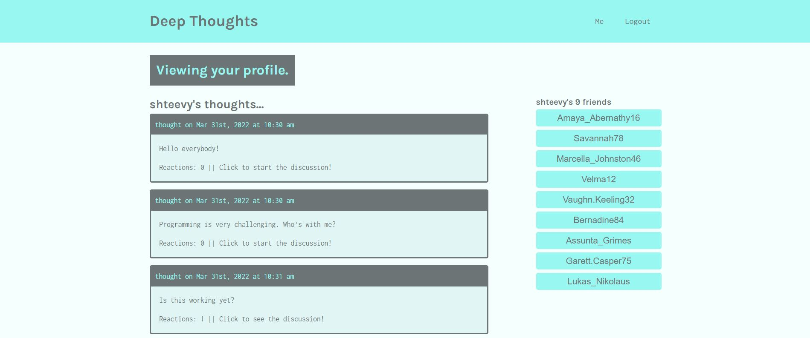
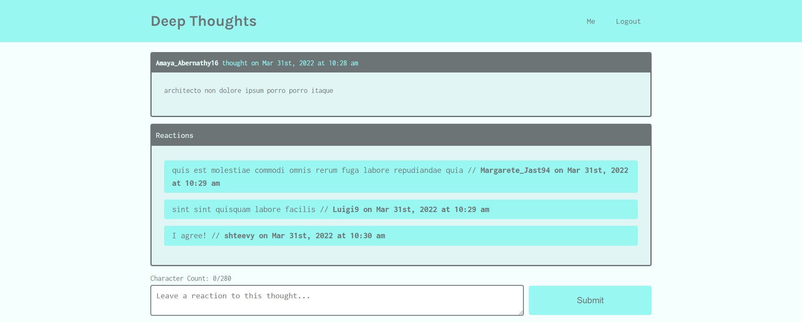

# Deep Thoughts

## Description
A pensive social networking site where visitors can view thoughtful and diverse conversations, topics, and replies about anything and everything!  Sign up as a user to join the conversation by adding new thoughts, replying to existing thoughts, and staying connected by adding other users as friends.

## **Table of Contents**
* [Screenshots](#screenshots)
* [Programs](#programs)
* [Website](#website)
* [Usage](#usage)
* [License](#license)
* [Questions](#questions)

## **Screenshots**

## **Programs**
* Apollo
* Apollo Server Express
* bcrypt
* Bootstrap
* Concurrently
* CSS
* dotenv
* Express
* Faker
* GraphQL
* Heroku
* HTML
* JavaScript
* JSON Web Token
* JWT Decode
* MongoDB
* Mongoose
* Node
* nodemon
* React
* React Router
* Web Vitals

## **Website**
<a href="https://floating-taiga-61859.herokuapp.com/" target="_blank">Deep Thoughts</a>

## **Usage**
***Note: Using Chrome is highly recommended for the optimal experience***
1. Visit the site using Chrome on your computer or smart phone
2. Scroll to view the latest thoughts and click on a single thought to read the replies
3. Sign up and log in as a user to add thoughts to the discussion, post reactions to thoughts, and add other users as friends
4. Once logged in, click the 'Me' link at the top of the page to visit your profile, view your posted thoughts, and see a list of your friends
5. Encourage your friends and family to sign up and share their observations and musings!

## **License**
The project is distributed under the [Creative Commons License](https://creativecommons.org/publicdomain/zero/1.0/)

## **Questions**
Please contact me directly with any additional questions:
* [GitHub](https://github.com/ChristopherLawn)
* [Email](mailto:christopher.d.lawn@gmail.com)